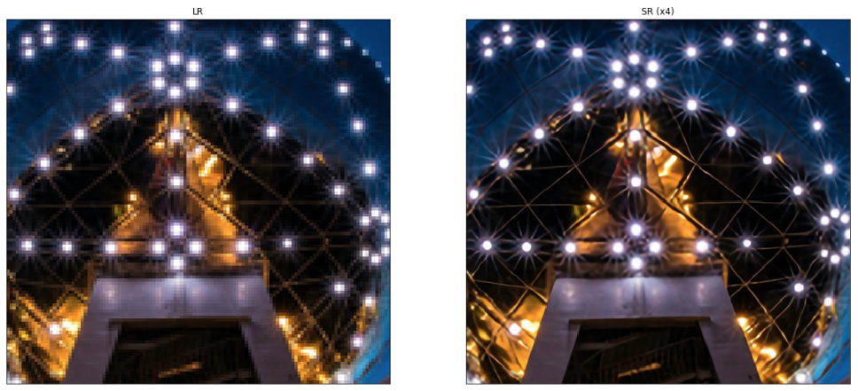

# opensw23-HellOSW

## Team Introduction

✨이태혁 202211350 - team_Leader

✨성승재 202011309 - Coder

✨김도현 202011257 - Github Expert

✨김동호 202211267 - Presentation

## Topic Introduction

Input에 하나의 저해상도 이미지를 넣었을 때 이를 고해상도로 변환시켜 Output으로 내보내는 문제인 **Single Image Super-Resolution**(이하 SISR)를 다루는 저장소이다. SISR의 다양한 알고리즘 중 EDSR, WDSR, SRGAN 이 포함되어있다.

**EDSR** : 깊은 신경망 구조를 사용하여 단일 이미지 초해상도 복원에 특화

**WDSR** : 넓은 활성화 함수를 사용하여 다중 이미지 초해상도 복원에 특화

**SRGAN** : GAN의 경쟁적인 학습을 통해 고해상도 이미지의 진짜같은 결과물을 생성

기본적으로 사진의 픽셀을 더 잘게 쪼개서 각 픽셀의 RGB 값을 조정하여 사진의 해상도를 높인다. 그리고 이 RGB 값을 조정하는 알고리즘에 따라 복원한 사진의 퀄리티가 달라진다.


## Result

### dataset 구성
이미지 크기가 400X400를 넘지 않은 사진들과 직접 찍은 사진들로 구성됨.

### wdsr 실행 예시


### edsr 실행 예시


### srgan 실행 예시


### edsr, wdsr, srgan 각 결과 비교

좌상부터 오른쪽으로 순서대로 원본, edsr, wdsr, srgan

벚꽃


도시


구름


라면


### 글씨 super resolution( by srgan )


## Analysis/Visualization

여려가지의 샘플을 돌려 본 결과 모델별로 큰 차이는 느낄 수 없었다. 하지만 자세히 확대하여 보게 된다면 픽셀의 수가 확실히 늘어난것을 확인 할 수 있었다.(Presentation에서 자세히)

샘플들 중 글씨가 존재하는 사진은 해상도를 높여도 흐린 글씨가 다시 읽을 수 있게 되지는 않았다. 그림에서의 super resoulution은 디테일을 높여 전체적인 해상도가 올라간다는 느낌을 주지만 만약 글자 이미지라면 해상도를 높여도 정확한 글자의 형태를 잡지 못하기 때문에 읽을 수 없다고 느껴진다.

가장 큰 문제점은 큰 사이즈, 즉 픽셀이 매우 많은 이미지는 실행을 하기 어렵다는 것이다. 테스트 결과 CPU가 i5-8500인 컴퓨터에서 최대 500X500 사이즈인 이미지의 해상도를 올릴 수 있다는 것으로 나왔다. 더 좋은 환경에서 테스트 해보진 못했지만 더욱 극적인 차이를 만들기 위해서는 매우 좋은 CPU에서 작동을 해야할 것 같다.

**✨결론**:

최신 휴대폰으로 찍은 사진은 기본적으로 해상도가 매우 높기 때문에 이 코드를 통해 해상도를 높이려면 원본사진의 해상도를 낮춰 작동시킬 수 있는 사진을 만든 후 작업을 실행해야해서 사실 상 의미가 없다고 할 수 있다.

하지만 이미 원본 사진의 픽셀이 적은 사진은 글씨가 없다는 전제하에 확연히 자연스럽게 해상도가 높아진 모습을 볼 수 있었다.

이 코드는 원본 사진의 픽셀 수 가 매우 적은 사진을 조금 더 해상도를 높이는 작업에 적절한것 같다.

## Installation

> conda(anaconad Prompt)가 설치 되어있어야함
>
> > 설치 방법은 installation 밑부분에 기재함.

> 테스트 된 실행 환경: 
> 
>                     i5-1155G7 / intel iris(R) Xe
> 
>                     i5-11400H / intel(R) UHD Graphics
>                     
>                     Mac OS에서는 테스트 안됨

### 1. 레파지토리를 clone

### 2. anaconda prompt를 실행시키기


이후 git clone 된 폴더로 이동한다.


### 3. 환경 설정

```
conda env create -f environment.yml
conda activate sisr
```

를 순차적으로 실행한다.

### 4. jupyter notebook 실행시키기


이렇게 새로운 .ipynb파일을 만들어 준비한다.

### 5. 샘플 코드 실행해보기

> 원하는 모델로 실행 해본다.

#### EDSR

```python
from model import resolve_single
from model.edsr import edsr
from utils import load_image, plot_sample

model = edsr(scale=4, num_res_blocks=16)
model.load_weights('weights/edsr-16-x4/weights.h5')

lr = load_image('demo/0851x4-crop.png')#이 부분을 바꾸어 원하는 이미지 입력
sr = resolve_single(model, lr)

plot_sample(lr, sr)
```



#### WDSR

```python
from model.wdsr import wdsr_b
from model import resolve_single
from utils import load_image, plot_sample

model = wdsr_b(scale=4, num_res_blocks=32)
model.load_weights('weights/wdsr-b-32-x4/weights.h5')

lr = load_image('demo/0829x4-crop.png')#이 부분을 바꾸어 원하는 이미지 입력
sr = resolve_single(model, lr)

plot_sample(lr, sr)
```


Weight normalization in WDSR models is implemented with the new `WeightNormalization` layer wrapper of
[Tensorflow Addons](https://github.com/tensorflow/addons). In its latest version, this wrapper seems to
corrupt weights when running `model.predict(...)`. A workaround is to set `model.run_eagerly = True` or
compile the model with `model.compile(loss='mae')` in advance. This issue doesn't arise when calling the
model directly with `model(...)` though. To be further investigated ...

#### SRGAN

```python
from model.srgan import generator
from utils import load_image, plot_sample
from model import resolve_single

model = generator()
model.load_weights('weights/srgan/gan_generator.h5')

lr = load_image('demo/0869x4-crop.png')# 이부분을 바꾸어 원하는 이미지로 입력
sr = resolve_single(model, lr)

plot_sample(lr, sr)
```


### conda 다운 받기

#### 주의: miniconda 설치 경로에 한글이 있으면 안됨(사용자명이 영어여야한다)

> 현재 확인한 바로는 기본경로가 아닌 다른경로로 설치하게 되면 오류 발생함.

miniconda Link: [miniconda][minicondalink]

[minicondalink]: https://conda.io/en/main/miniconda.html "Go miniconda download"

window용 installer을 다운받는다(다운 설정 변경X)
anaconda prompt가 설치되었다면 완료

## ✨Extra Implement

복원된 해상도의 사진을 저장하고 싶다면 아래의 코드를 추가해서 실행하면 된다.

```python
from PIL import Image
import numpy as np
np_arr=np.array(sr,dtype=np.uint8)
img=Image.fromarray(np_arr)
img.save('./save1.jpg')
```

## Presentation

https://youtu.be/Ck-fohDc8S0
